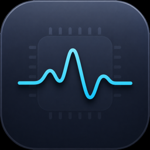

#  SiliconPulse

SiliconPulse is a minimal, useful macOS menu bar monitor for Apple Silicon. It keeps the daily view calm and readable while still giving you quick access to CPU, GPU, memory, network, storage, battery, thermals, fans, and top processes when you need to inspect what is happening.



## Features

### Menu Bar Dashboard
- **CPU** — usage gauge, temperature badge, per-core bars (optional), compact trend chart
- **GPU** — utilization via IOAccelerator / IOReport (hidden when unavailable)
- **Memory** — used/total, pressure gauge, optional breakdown (App, Wired, Compressed, Free)
- **Network** — live download/upload speeds, session totals, dual-line trend chart
- **Storage** — per-volume usage and free space
- **Power** — charge level, time remaining, cycles, health (when a battery is present)
- **Fans** — RPM readout and manual control (Automatic / Manual / Maximum / Off)
- **Thermal** — system thermal pressure level and description

The menu bar label shows live **CPU %** and **memory %**, with a warning icon when thermal pressure is elevated.

### Top Processes Window
- Sort by CPU, memory, or name
- Search/filter by process name
- Process detail view with usage gauges
- Terminate processes (SIGTERM, then SIGKILL)

### First-Run Onboarding
- Choose whether SiliconPulse launches at login
- Pick the default refresh pace
- Start with a focused set of useful dashboard sections

### Settings
Tabbed preferences (General, Display, Network, Processes, About):
- Update interval (1s, 2s, 5s)
- Toggle dashboard sections
- °C / °F, B/s vs bps, network history length
- Default process sort order
- Reset all preferences

### Fan control (Apple Silicon)
Reading fan speeds uses SMC via IOKit. **Writing** fan speeds on Apple Silicon requires installing a privileged helper (`FanHelper`) via `SMJobBless` the first time you change fan mode — macOS will prompt for your password. Fan control availability varies by Mac model; some Apple Silicon machines expose limited or no SMC fan keys.

## Requirements

- **macOS 14.0** or later
- Apple Silicon Mac recommended (Intel builds are supported; some GPU/fan paths differ)

## Installation

1. Download the latest `SiliconPulse.dmg` from [Releases](https://github.com/alan13367/SiliconPulse/releases).
2. Open the DMG and drag **SiliconPulse** to **Applications**.
3. Launch the app. If Gatekeeper blocks an unsigned build, right-click the app and choose **Open**.

### Homebrew

Homebrew support is available through the personal tap:

```bash
brew tap alan13367/tap
brew install --cask siliconpulse
```

Official Homebrew submission requires a stable public release artifact that passes Gatekeeper on supported macOS versions.

This build is distributed without Apple notarization. If macOS blocks the app after installation, right-click **SiliconPulse.app** and choose **Open**.

## Usage

SiliconPulse runs as a menu bar app (no Dock icon). Click the menu bar item to open the dashboard.

**Footer controls**
| Control | Action |
|---------|--------|
| **Every Xs** | Change refresh rate (1 / 2 / 5 seconds) |
| **List** | Open Top Processes window |
| **Gear** | Open Settings (⌘,) |
| **Power** | Quit SiliconPulse |

## Development

### Requirements
- macOS 14.0+
- Xcode 15.0+ with the macOS SDK
- Apple Development signing team configured (required for FanHelper `SMJobBless`)

### Build

```bash
xcodebuild -project SiliconPulse.xcodeproj -scheme SiliconPulse -configuration Debug build
```

### Run the built app

```bash
APP_PATH="$(find ~/Library/Developer/Xcode/DerivedData -name "SiliconPulse.app" -type d | grep -v "Index.noindex" | head -n 1)"
open -n "$APP_PATH"
```

### Build and launch (one command)

```bash
./script/build_and_run.sh
```

### Verify

```bash
./script/build_and_run.sh --verify
```

### Package a release DMG

```bash
./script/package_release.sh
```

### Project layout

See [AGENTS.md](AGENTS.md) for architecture, private API notes, and agent-oriented build/debug instructions.

```
SiliconPulse/
├── SiliconPulse/          # Main app (SwiftUI views, services, models)
├── FanHelper/             # Privileged helper for SMC fan writes (arm64)
└── SiliconPulse.xcodeproj
```

## Contributing

Contributions are welcome. Open an issue for bugs or feature requests, or submit a pull request.

## License

MIT License — see [LICENSE](LICENSE).

---

*Created by Alan Beltran Pozo.*
